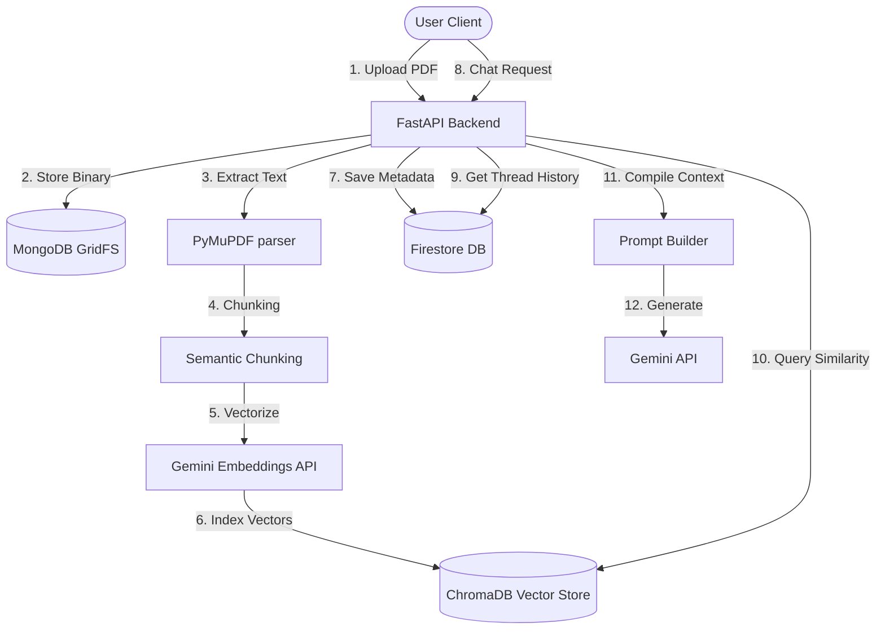

# DocMind AI 📄

DocMind AI is a state-of-the-art, secure, and production-ready RAG (Retrieval-Augmented Generation) web application that enables users to upload PDF documents, parse and index them locally, and engage in context-aware conversations. Built with a robust modern stack combining **Next.js (App Router)**, **FastAPI**, **MongoDB GridFS**, **ChromaDB**, **Firestore**, and the new official **Google GenAI SDK**.

---

## 🚀 Key Features

*   **Secure Authentication**: Integrated Firebase Authentication to protect user sessions.
*   **GridFS Storage**: Complete removal of Firebase Storage in favor of local MongoDB GridFS storage using chunked binary uploads.
*   **Semantic Chunking Pipeline**: Monotonic sliding index chunking (500–700 words, 100-word overlap) with overlap guards.
*   **Local Vector Database**: Semantic similarity index searches using **ChromaDB** with embeddings generated via the Gemini `models/gemini-embedding-2` API.
*   **Multi-Model Resiliency**: Automated fallback routing (Groq `llama-3.3-70b-versatile` as primary LLM ➔ Gemini Flash as fallback LLM) to guarantee high availability and error recovery.
*   **Memory-Preserving Conversations**: Conversation history tracking via Firestore with pagination-aware smooth scroll layouts.

---

## 🏗️ Architecture & Data Flow



---

## 🛠️ Tech Stack

*   **Frontend**: React, Next.js (App Router, Tailwind CSS), Axios.
*   **Backend**: Python, FastAPI, Uvicorn.
*   **Database / Storage**: MongoDB Atlas (GridFS), Google Cloud Firestore.
*   **Vector Search**: ChromaDB, Gemini Embeddings API (`models/gemini-embedding-2`).
*   **AI Services**: Groq (Primary LLM via `llama-3.3-70b-versatile`) and Google Gemini (Fallback LLM & Embeddings API).
*   **Security**: Firebase Auth JWT verification middleware.

---

## 📂 Project Structure

```
DocMind AI/
├── backend/
│   ├── chroma_db/               # Local vector storage
│   ├── models/                  # Pydantic validation schemas
│   ├── routes/                  # API endpoints
│   ├── services/                # Business logic services
│   │   ├── chunk_service.py     # semantic overlap chunker
│   │   ├── embedding_service.py # local vector generator
│   │   ├── gemini_service.py    # fallback LLM service
│   │   ├── pdf_service.py       # text extractor
│   │   ├── retriever_service.py # similarity searcher
│   │   └── vector_db_service.py # vector controller
│   ├── uploads/                 # Local processing cache (ignored)
│   ├── .env                     # Local credentials (ignored)
│   ├── app.py                   # Server startup, audit, & main routes
│   └── requirements.txt         # PyPI package dependencies
├── src/
│   ├── app/                     # Next.js page views
│   ├── components/              # React UI layout elements
│   ├── context/                 # Context and API hooks
│   ├── lib/                     # Client libraries (Firebase, Axios)
│   └── services/                # Axios wrappers
├── .gitignore                   # Safe deployment ignores
└── README.md                    # Project documentation
```

---

## ⚙️ Environment Variables

### Backend Configuration (`backend/.env`)

| Variable | Description | Default / Example |
| :--- | :--- | :--- |
| `MONGO_URI` | MongoDB Atlas cluster connection string | `mongodb+srv://...` |
| `MONGO_DB_NAME` | MongoDB database name | `docmind_ai` |
| `GEMINI_API_KEY` | Google AI Studio API Key | `AIzaSy...` |
| `GEMINI_MODELS` | Fallback models list (comma-separated) | `gemini-2.5-flash,gemini-2.0-flash` |
| `BACKEND_URL` | Server backend deployment hostname (Render URL) | `https://docmind-ai-backend-vcvi.onrender.com` |
| `FIREBASE_SERVICE_ACCOUNT` | Fallback Firebase service key credentials JSON string | `{"type": "service_account", ...}` |

### Frontend Configuration (`.env.local`)

| Variable | Description | Default / Example |
| :--- | :--- | :--- |
| `NEXT_PUBLIC_API_URL` | Production FastAPI server host URL | `https://docmind-ai-backend-vcvi.onrender.com` |
| `NEXT_PUBLIC_FIREBASE_API_KEY` | Firebase Client SDK API Key | `AIzaSy...` |

---

## 🔧 Installation & Setup

### 1. Prerequisites
*   Node.js v18+ & npm
*   Python 3.10+
*   MongoDB Cluster & Firebase Web App setup

### 2. Backend Installation
Navigate to `/backend`, set up virtual environment and install packages:
```bash
cd backend
python -m venv venv
.\venv\Scripts\activate
pip install -r requirements.txt
```

Place your Firebase Admin SDK service account key json in `/backend/firebase_service_account.json` (do not commit this file).

Configure your `/backend/.env` file.

### 3. Frontend Installation
Navigate to the root folder and install packages:
```bash
npm install
```

Configure your `.env.local` containing your Firebase web configuration credentials:
```env
NEXT_PUBLIC_FIREBASE_API_KEY=...
NEXT_PUBLIC_FIREBASE_AUTH_DOMAIN=...
NEXT_PUBLIC_FIREBASE_PROJECT_ID=...
```

---

## 🏃 Running the Application

### Start the Backend Server (FastAPI)
```bash
cd backend
.\venv\Scripts\activate
python -m uvicorn app:app --reload
```

### Start the Frontend Server (Next.js)
```bash
npm run dev
```

---

## 📡 API Overview

| Method | Endpoint | Auth | Description |
| :--- | :--- | :--- | :--- |
| `GET` | `/health` | No | Health check validating MongoDB, Firestore, ChromaDB, and Gemini connection statuses. |
| `POST` | `/upload` | Yes | Upload PDF files using multipart/form-data directly to MongoDB GridFS. |
| `GET` | `/documents` | Yes | List all uploaded document metadata for the logged-in user. |
| `POST` | `/chat` | Yes | Conversational generation utilizing vector searches and history memory. |
| `DELETE`| `/documents/{id}` | Yes | Complete document deletion (GridFS binary, Chroma vectors, chat thread history, and local JSONs). |

---

## 🔒 Security Policy
*   **Secrets Shield**: Strict validation of environment variables. No keys or connection credentials are saved or printed to stdout.
*   **Path Traversal Prevention**: Document IDs and uploads are sanitized to block path-manipulation attacks.
*   **CORS Rules**: Origins are locked down in production configurations.
*   **File Constraints**: Upload size validation restricts payloads above 20MB.

---

## 💡 Troubleshooting
*   **MongoDB Authentication Error**: Verify user credentials and whitelist access IPs inside MongoDB Atlas.
*   **Firebase Admin Error**: Verify `firebase_service_account.json` credentials format matches the download key schema exactly.
*   **Uvicorn Unicode Crash**: Server encoding is reconfigured dynamically to prevent CP1252 errors on Windows shells.

---

## 📄 License
This project is licensed under the MIT License.
